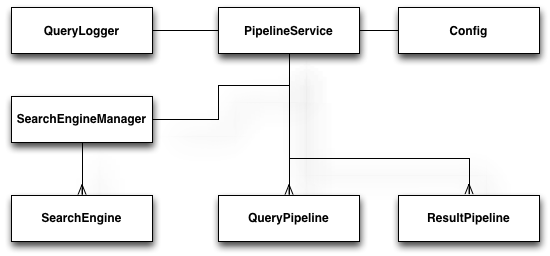
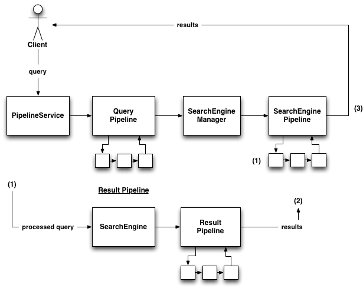

.. _pipeline_architecture:

Paradigm 2 - One Pipeline, Many Search Engines
=================================================

The core idea behind this alternate paradigm is that you create and manage one pipeline - to which search engines can then be added. This is in contrast to the ‘search service’ paradigm (:ref:`service_architecture`), where each search service, and its associated search engine wrapper, has its own distinct pipeline. Like with the ‘Search Service’ paradigm, there is a query pipeline and the result pipeline, but, in addition to this, there is an additional pipeline: the search engine pipeline (which makes use of a search engine manager; this is equivalent, in most respects, to the ‘Search Service Manager’ from the ‘search service’ paradigm). 

The picture below shows how all these components relate to each other:

   *The basic architecture of a PuppyIR application, using the 'Pipeline Service' paradigm.*

Description of the components
*****************************
Each of the key components, shown in the picture above, are summarised (in terms of how they relate to this paradigm) below; except for the ‘Query Logger’ and ‘Config’ components as these are identical to those found in the ‘Search Service’ architecture.

The roles of the components are as follows:

* **Pipeline Service**: this is the main component in this paradigm as it is in charge of managing and running the pipeline it defines (i.e. all the filters and modifiers). It also contains the next key component, the 'search engine manager'.
* **Search Engine Manager**: this component is, roughly, equivalent to the 'search service manager' as found in the ‘search service’ paradigm; except that it manages search engines as opposed to search services. Its main tasks are adding and removing search engines.
* **Search Engine**: this is the component managed by the search engine manager and is the same as in the ‘search service’ paradigm; except that it’s linked to the 'pipeline service' not a search service. Like in ‘search service’ each search engine has a name assigned to it and the 'search engine manager' looks for, deletes and retrieves search engines using this variable.
* **Query and Result Pipelines**: these are exactly the same as their counterparts in the ‘search service’ paradigm, excepting that they are stored by a 'pipeline service'.

Data flow in the 'Pipeline' paradigm
***************************************

The data flow in this paradigm is a little more complicated than in the ‘search service’ paradigm, due to the extra complexity introduced by having multiple search engines associated with one pipeline. The picture below shows the data flow between a user issuing a query and their receiving the result(s) of this query.

   *The basic data-flow diagram for the 'Pipeline Service' paradigm.*

The 'pipeline service' is passed a query, by the user/client, via one of two methods: search all or search specific. From here, the query pipeline is run (once; even if there are multiple search engines - since they all have the same query and query pipeline), first going through all the filters and then all the modifiers. Following this, the 'search engine manager' is called to retrieve either: all the search engines it manages, or one specific one. The next step is to run through the 'search engine pipeline' with the results of the previous step. (1) shows the entry point for this process, at this stage either each search engine will be processed in turn or, in the case of a specific search, only one will be processed (as defined by the search specific call). 

In the above diagram, the section under the label 'Result Pipeline' shows how the processing of a search engine works: 

* the processed query is passed to the current search engine (going through the pipeline); 
* next, the search method for this search engine is called and the results retrieved; 
* then the result filters, followed by the result modifiers are run (this step is the same as the result pipeline from 'search service' - just applied to each search engine in turn);
* lastly, the results from the current search engine are added to the overall 'results' at (2).

Once the above process has been completed, for each search engine, the overall 'results' are returned - (3) shows the point at which the overall 'results' are complete and can then be returned to the user/client.

On Filters, Modifiers and Query Logging
***************************************

Within the query and result pipelines there are both filters and modifiers. Filters are executed first and then, following this, the modifiers are executed.

The distinction between a filter and a modifier is as follows:

* **Filters**: these reject or accept a query, or result, based on a defined criteria. For example a blacklist filter rejects queries containing one or more blacklisted words.

* **Modifiers**: these change the content of a query, or result, based on a defined behaviour. For example, appending “for kids” to every query.

There are many different filters and modifiers available for both of these pipelines, please consult the :ref:`api` page for details of what is available.

There are two points at which queries can be logged: before the query goes through the query pipeline and after; i.e. un-processed and processed. The default is to log queries before processing - if a query logger has been added. The code below shows how to add a query logger and set it so that processed queries are logged, in addition to un-processed ones:

::

  from puppy.logging import QueryLogger
  from puppy.pipeline import PipelineService

  config = {"log_dir": "/path/to/log/dir"} # Sets the log directory
  pm = PipelineService(config)
  pm.query_logger = QueryLogger(pm)
  pm.postLogging = True # Activate post-pipeline query logging

The Query and Results formats
*****************************

Referring to the data flow diagram above, the formats of a query and results are:

* A query is in the 'Query' format (for more see: :ref:`puppy_query`).
* The results format is a Python dictionary, with one entry for each search engine; the key being the named assigned to the search engine and the value being the response (for more see: :ref:`puppy_response`) object returned from the search call (for the search engine in question).

Both the Query and Response formats are implementations of the OpenSearch specification; for more details, see the links below:

* `OpenSearch Query <http://www.opensearch.org/Specifications/OpenSearch/1.1#OpenSearch_Query_element>`_.
* `OpenSearch Response <http://www.opensearch.org/Specifications/OpenSearch/1.1#OpenSearch_response_elements>`_.

Possible advantages of using this architecture
**********************************************

This paradigm has the potential to be more efficient than the ‘search service’ paradigm, in terms of code and effort on the part of a developer/researcher, in the following ways:

* If you want the same pipeline (filters etc) for multiple services you only need to set the pipeline up once and can just add the search engines you want to the 'search engine manager' (contained by your 'pipeline service').
* Related to the above point, is that the Query pipeline is only run once with 'searchAll' because all the search engines use the same pipeline.
* Less code for getting results - just a simple 'searchAll' call rather than a search call for each search service and the associated code to handle this.

Further Reading
***************

An example of the usage of this paradigm is given in: :ref:`pipeline-puppyir-tutorial`.