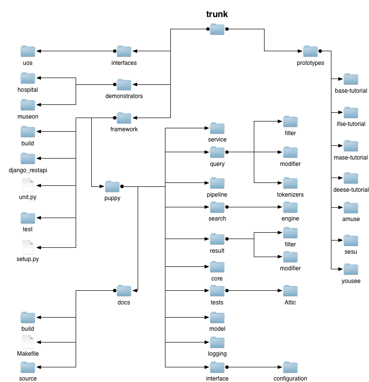
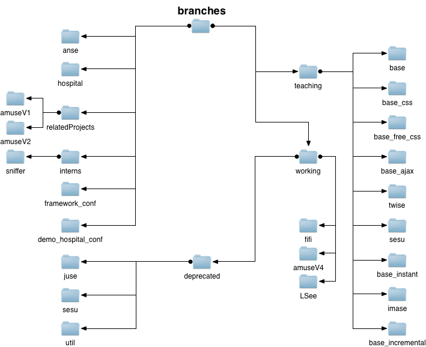

.. _repo:

The structure and the PuppyIR repository
==========================================================

The PuppyIR repository is organised into three folders: trunk, branches and tags. Each of these folders is detailed below, with a picture of their structure and a short description of their contents.

To checkout the whole repository (this is a large download of ~600MB) and browse to the top level of the repository use the following commands:

::

  $ svn co https://puppyir.svn.sourceforge.net/svnroot/puppyir puppyir
  $ cd puppyir

N.B. the diagrams shown in this section are simplified, in that, except for a couple of exceptions, no files are shown; only folders. Also, standard Django application folders (e.g. *site_media* ) are not shown, in order to make the diagrams easier to read.

Trunk
----------------

This section is the main development area of PuppyIR, it contains the latest version of the framework and various applications (plus demonstrators) that make use of it. Following the diagram below, the key sections of trunk's contents are summarised.

   *Diagram showing the structure of the 'trunk' folder in the repository.*

Trunk/Framework
----------------

This folder contains the latest version of the framework, the test suite and the documentation (both the source and compiled versions).

The framework is organised as follows:

* **build** and **setup.py**: is the build directory (for when installing the framework) and the Python script to install the framework itself.
* **puppy**: the framework itself, its components are detailed below.
    * **core**: contains a type checking system and also various components for running threads.
    * **docs**: the documentation for the framework, including the source and compiled versions, in addition to a make file to compile the source.
    * **interface**: contains an early version of a Django application for configuring a search service.
    * **logging**: contains the query and event loggers.
    * **misc**: contains assorted files regarding aspects like stylistic conventions for code in the framework.
    * **model**: contains all the classes associated with the OpenSearch standard.
    * **pipeline**: contains the search engine manager and pipeline service classes, used when developing an application using the pipeline service paradigm (see: :ref:`pipeline_architecture`).
    * **query**: contains all the filters and modifiers belonging to the query pipeline, in addition to the associated exceptions. It also contains various query tokenizers.
    * **result**: contains all the filters and modifiers belonging to the result pipeline, in addition to the associated exceptions.
    * **search**: contains all the search engine wrappers and associated exceptions.
    * **service**: contains the service manager and search service classes, used when developing an application using the search service paradigm (see: :ref:`service_architecture`). It also contains early work on configurable versions of the aforementioned, but, since these are tied into Django - they are not automatically imported by the framework.
    * **tests**: an old legacy version of the test suite; the new version is detailed below and supersedes this one.
* **test** and **unit.py**: contains the test suite directory and the Python script for running the tests, please see: :ref:`the_puppyir_framework_test_suite` for details of this component.

Trunk/Demonstrators
--------------------------------

In the trunk there are two demonstrators which serve as showcases for the PuppyIR project; these demonstrators are described below.

Hospital Demonstrator
^^^^^^^^^^^^^^^^^^^^^

This demonstrator, also known as the Emma Search service (EmSe), is being built for Emma Kinderziekenhuis (EKZ), which is part of the Amsterdam 
Medical Centre (AMC). At the EKZ, children have access to a dedicated information centre as well as a dedicated bedside terminal. A user study carried out by hospital staff, from the information centre, has uncovered that children are reluctant to engage with the physical information centre (depending instead upon a family member or carer) and so, EmSe is designed to make use of these bedside terminals to allow them to access this resource via the web.

The goals of this demonstrator are, in summary, to: 

1. improve knowledge of existence and contents of the extensive library of resources, available at the information centre; 
2. improve the accessibility of the information centre and its content for children; 
3. expand the information content (from the Information Centre), with reference to more extensive information on the internet that is both appropriate and suitable for children. 

EmSe assists the children by providing appropriate query suggestions, simplifying difficult content and filtering unsuitable content based on age appropriateness.

.. figure::  images/puppy-emse.png
   :align:   center

   *EmSe in action showing results from all the services; the dog's speech bubble is a query suggestion with the thought bubble containing more suggestions.*

Musueon Demonstrator
^^^^^^^^^^^^^^^^^^^^^^

The Museum Demonstrator creates an interactive museum visit, using advanced technologies such as multitouch tables and marker tracking, creating the basis for additional data retrieval & filtering using the PuppyIR framework. Up to four users can use a multitouch table simultaneously, to browse through the different exhibition subjects and together they determine the contents of an interactive quest. 
  
Subsequently, in a trail through the exhibitions, users/players answer questions related to the chosen topics that have to be found. Throughout the museum, various touch-screens equipped with scanners (for reading and identifying the players) are installed, that when 
triggered, present the questions and provide feedback to answers. 

After all questions have been answered, the multitouch table provides the children with further information about the exhibits they visited.

.. figure::  images/puppy-musueon.png
   :align:   center

   *The Musueon demonstrator being used on multitouch tables; showing various topics.*

You can view a video of this demonstrator in action by visiting: http://www.youtube.com/watch?v=b5zycfgqlKo

Prototypes
^^^^^^^^^^^^^^^^^^

This folder contains various prototypes made using the latest version of the framework. These prototypes are either completed. or in the late stages of development and so are all in a demonstrable state.

These prototypes are detailed in: :ref:`prototypes` - please consult this page for more.

Interfaces
^^^^^^^^^^^^^^^^^^

This folder contains the University of Strathclyde's experimental environment on collaborative search interfaces.

Branches
-------------------

This folder contains standalone components, related projects (made by students using the PuppyIR Framework) and unfinished/work-in-progress prototypes.

   *Diagram showing the structure of the 'branches' folder in the repository.*

Branches contains:

* **AnSe** this is an application that uses the PuppyIR framework to query, using the Bing and YouTube wrappers, and retrieve results in the JSON format. It is totally standalone, as it contains its own, simplified, local copy of the PuppyIR framework.
* **conf demos (framework and hospital)** these are early versions of a method to allow for easy configuration of these resources.
* **Interns**: a application called **sniffer**, created by a student intern working on PuppyIR, this application consists of: a search application similar to BaSe (see below for more on BaSe) and an automated logging application called ALF (Automated Logging Facility).
* **Related Projects** this contains applications created by students using the PuppyIR framework - this folder contains its own documentation which details its contents and various other aspects, like how to install them.
* **Teaching**: this folder contains various applications created (using the PuppyIR framework) as part of the *Internet Technology* and *Distributed Information Management* courses at the University of Glasgow to teach students about web development. The individual applications it includes are:

    * **BaSe**: a basic search engine that searches for and display web results.
    * **BaSe CSS**: same as BaSe, but with CSS styling applied to it.
    * **BaSe Free CSS**: same as BaSe, but with multiple different styles available and style switching code (in JavaScript).
    * **BaSe Ajax**: same as BaSe, but it searches for, retrieves and displays web results using Ajax.
    * **BaSe Instant**: same as above, but using code from a live in-lecture demo - no major differences to BaSe Ajax.
    * **BaSe Incremental**: an alternate Base Ajax tutorial, for creating an Ajax based search applications using the PuppyIR Framework.
    * **TwiSe**: a basic Twitter search engine, for finding and displaying tweets.
    * **SeSu**: another alternate version of the now deprecated SeSu prototype.
    * **ImaSe**: a basic image search engine for finding and displaying images.
* **Working**: this folder contains prototypes that, while using the latest version of the framework, are still work-in-progress. These prototypes are described at the end of the *branches* section.

    * **Deprecated**: these prototypes use an outdated local version of the framework, **util**. SeSu does not work anymore, but JuSe does still function. Both applications and **util** are no longer supported (however, SeSu has been remade, with the latest version of the PuppyIR Framework, and can be found in *trunk*).

Work-in-progress prototypes
^^^^^^^^^^^^^^^^^^^^^^^^^^^^^^^^^

There are several prototypes contained within the aforementioned 'working' folder. These prototypes provide further examples of how to use the framework but remain in-complete and as such, may contain flaws and/or not fully function.

* **aMuSeV4**: an application based around children retrieving image results and using these to create stories in a comic book style format. This application is still very incomplete.
* **FiFi**: this folder is a placeholder for an application deployed on a server at Glasgow - http://pooley.dcs.gla.ac.uk:8080/fifi/
* **LSee**: an application allowing children to search for a location and, from this location, retrieve a mash-up of search results (image, video, tweets and news) taken in that area. LSee (Location Search) is, functionality wise, fairly well developed but the layout and styling is very basic.

N.B. Once completed, these prototypes will be moved to *trunk/prototypes*.

Tags
---------------

This folder contains archived versions of the Hospital demonstrator (EmSe/Emma Search), the framework and the teaching applications (found in *branches*). These will only be of interest, with respect to the evolution of the various parts and/or in the event of having to revert to a older version of these components.

.. figure::  images/tag.png
   :align:   center

   *Diagram showing the structure of the 'tags' folder in the repository.*